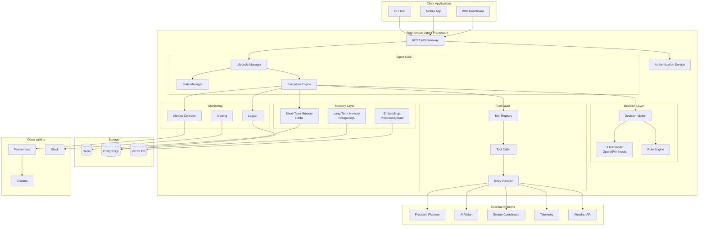
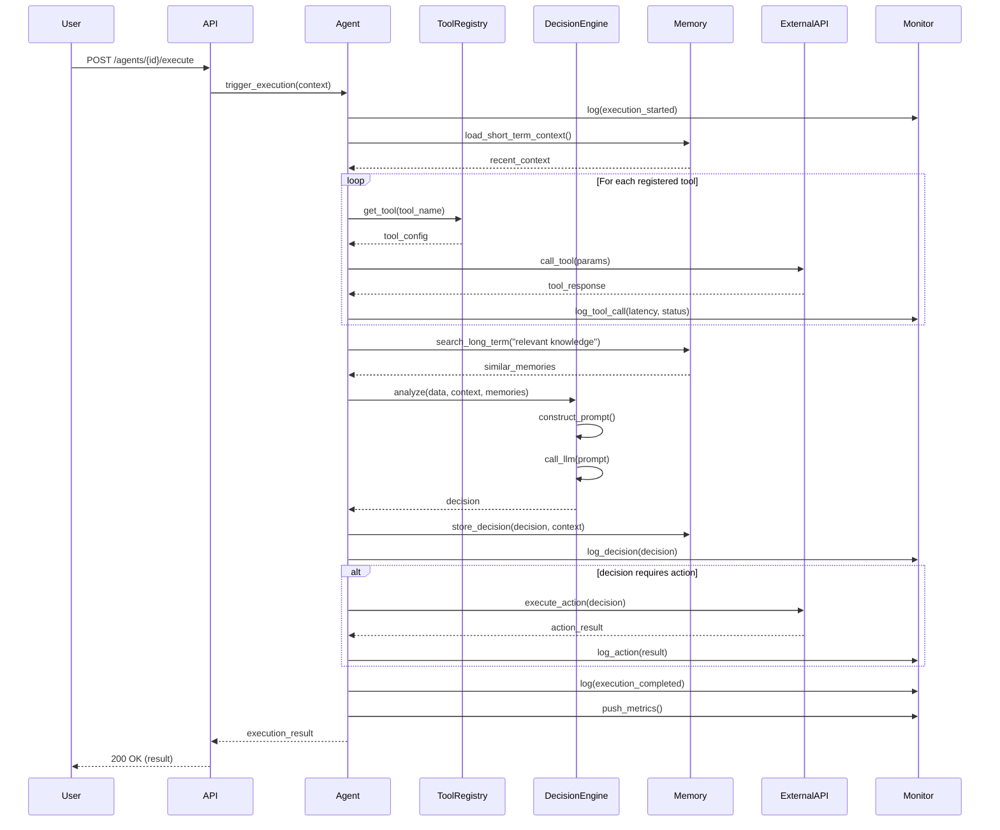
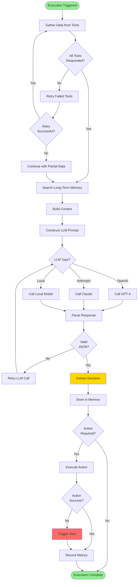
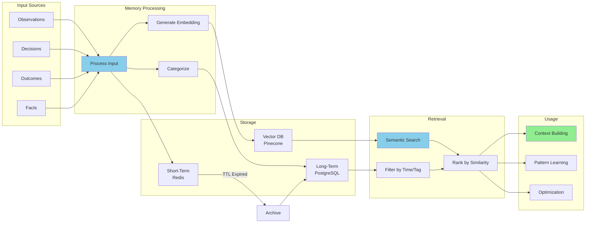
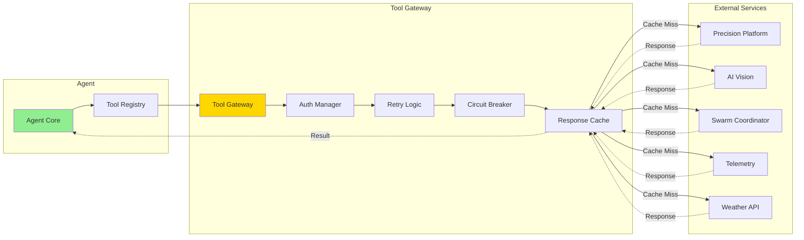
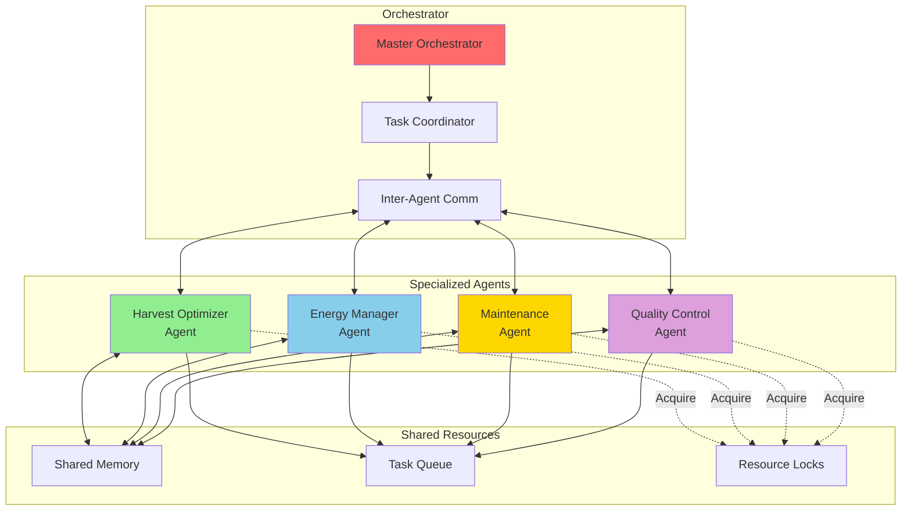
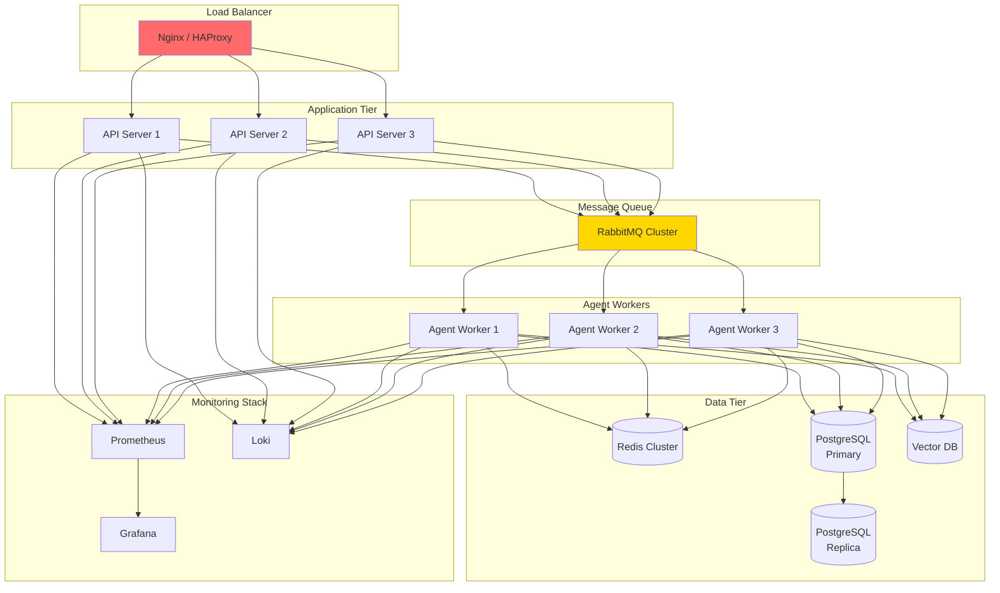
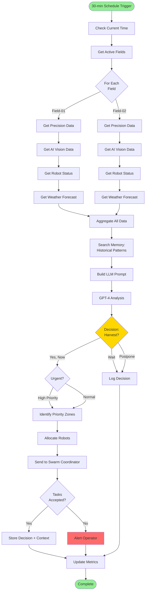

# Autonomous Agent Framework - Architecture Diagrams

## System Architecture

---

## Agent Execution Flow

---

## Decision Making Process

---

## Memory Management

---

## Tool Integration Pattern

---

## Multi-Agent Coordination (Future)

---

## Deployment Architecture

---

## Data Flow - Harvest Decision Example

